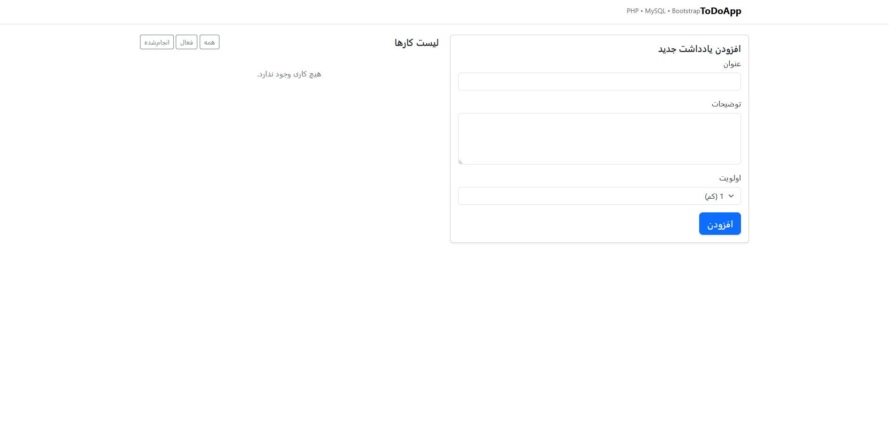

# 📝 ToDoApp PHP Project

[](https://www.php.net/)
[](https://getbootstrap.com/)
[](https://www.mysql.com/)

---

## 🚀 Project Overview

**ToDoApp** is a simple yet elegant task management application built with **PHP (vanilla)**, **MySQL**, and **Bootstrap 5**.  
It allows users to:

- ✅ Add, edit, and delete tasks  
- 🎯 Set task priority  
- ✔️ Mark tasks as completed or active  
- 🗂️ Filter tasks: All / Active / Completed  

This project is perfect for learning **PHP without frameworks** while also practicing **database operations**, **form handling**, and **Bootstrap styling with animations**.

---

## 🗂️ Project Structure
```
todoapp/
├─ index.php # Main page displaying tasks
├─ add.php # Add new task handler
├─ edit.php # Edit existing task
├─ toggle.php # Toggle completed status
├─ delete.php # Delete task handler
├─ includes/
│ ├─ db.php # Database connection
│ ├─ functions.php # Reusable functions
│ ├─ csrf.php # CSRF token generation & validation
│ ├─ header.php # Header HTML
│ └─ footer.php # Footer HTML
├─ assets/
│ ├─ style.css # Custom CSS (white theme + hover + animations)
│ ├─ screenshot.png
│ └─ app.js # Optional JavaScript
├─ database.sql # SQL script to create database & table
└─ README.md # Project documentation 
└─ Licence.txt # Project documentation
```


---
## 🎨Screenshot

---
## ⚡ Features

- **Add Tasks:** Users can create tasks with title, description, and priority.  
- **Edit Tasks:** Update title, description, or priority.  
- **Delete Tasks:** Remove tasks permanently with a confirmation popup.  
- **Toggle Completion:** Mark tasks as completed or revert to active.  
- **Filter Tasks:** Quickly view all, active, or completed tasks.  
- **Responsive Design:** Works on mobile, tablet, and desktop.  
- **Elegant UI:** White theme with hover effects and subtle animations.

---

## 🛠️ Installation & Setup (WAMP/XAMPP)

1. **Clone the repository**
```bash
git clone https://github.com/danialsource/todoapp.git
```
2. **Move the folder to your web server root:**

XAMPP:C:\xampp\htdocs\todoapp

WAMP: C:\wamp64\www\todoapp

3.**Create Database:**

Go to http://localhost/phpmyadmin

Create a database named todo_app

Import database.sql to create the tasks table

4.**Configure Database Connection:**
Edit includes/db.php:
$host = '127.0.0.1';
$db   = 'todo_app';
$user = 'root';
$pass = ''; // Default for XAMPP/WAMP
5.Run the App:
Open in browser:
http://localhost/todoapp/index.php

## 🌐 Optional: Run Online

You can deploy this project to free PHP hosting services:

 .000webhost

 .InfinityFree

 .AwardSpace

GitHub Pages cannot run PHP. It only serves static HTML/CSS/JS.

## 🛡️ Security Features

 .CSRF token protection for all POST forms (csrf.php)

 .Server-side validation of required fields

 .Escaping output to prevent XSS (esc() function in functions.php)

## 🎨 Styling

 .Bootstrap 5.3 for layout, forms, and buttons

 .White theme with subtle shadows

 .Hover effects on buttons and list items

 .Animated transitions for adding/removing tasks

 .Fully responsive for mobile and desktop

## 📌 Notes

 .Always use UTF-8 without BOM encoding for PHP files to prevent Parse errors

 .Use session_start() before any HTML output for CSRF or session usage

 .The database SQL file is included (database.sql) for easy setup

 ## 📚 Learning Outcomes

 .Vanilla PHP CRUD operations

 .MySQL database integration

 .Secure form handling (CSRF & XSS)

 .Responsive UI design with Bootstrap

 .File organization and project structure for small PHP apps

## 🖇️ License

MIT License © 2025
Feel free to clone, modify, or use for learning purposes.

#### 🌟 Made with ❤️ by danialsource
